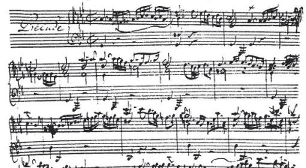
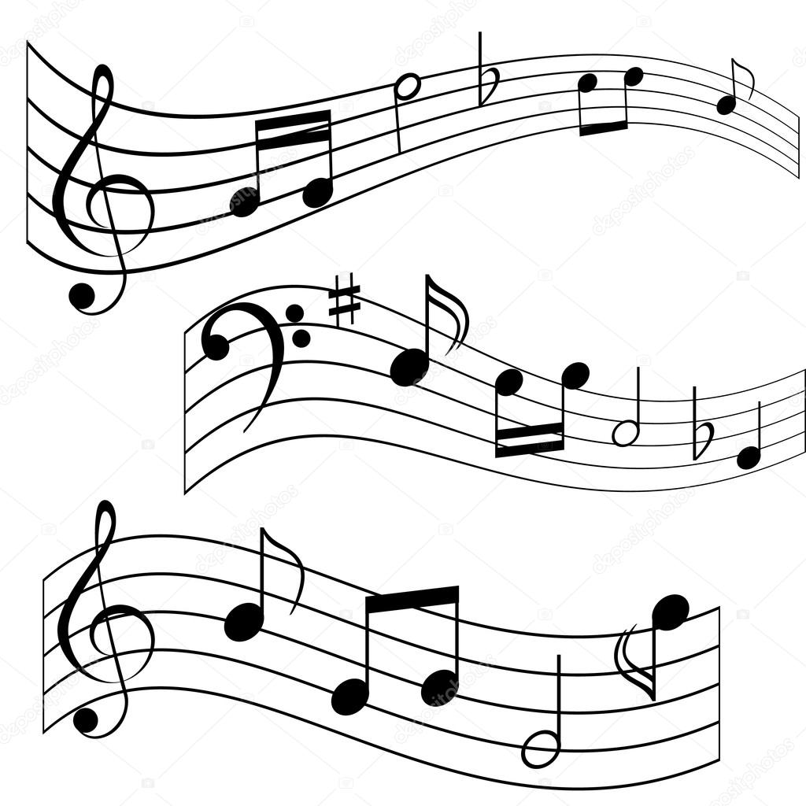

= _Elementy dzieła muzycznego_ 

** [x] https://www.youtube.com/watch?v=B2NT-EHmJ28[Elementy muzyki]
** [x] https://www.youtube.com/watch?v=ZN41d7Txcq0[Jak czytać muzykę?]

== W skład dzieła muzycznego wchodzą:
*  Rytmika
* Artykulacja
* Melodyka
* Harmonia
* Kolorystyka
* Agogika
* Dynamika

== Rytmika

To element muzyki wyznaczający proporcje czasu trwania dźwięków i przerw między nimi, czyli pauz. 

    ** Podstawową jednostką rytmu jest *wartość rytmiczna*, a podstawową wartością rytmiczną jest *cała nuta*.
       
== Artykulacja

To element muzyki wyrażający się w sposobie wydobycia i łączenia dźwięków.

    ** Trzy podstawowe rodzaje artykulacji:
•	`legato`, czyli łącząc płynnie ze sobą dźwięki, 
•	`staccato`, czyli odrywając je, grając krótko i ostro,
•	`portato`, czyli w sposób pośredni między legato a staccato.

== Melodyka

Przejawia się w uporządkowanym przez kompozytora zbiorze dźwięków występujących po sobie.

== Harmonia

Porządkuje współbrzmienie dźwięków w utworze.
`*Nadaje muzyce określony charakter i nastrój.*`

== Kolorystyka

Pozwala na dostrzeganie różnic między dźwiękami o tej samej wysokości zaśpiewanymi lub zagranymi przez różne instrumenty lub głosy.

image::kolorystyka.jpg[c700x420,550]

== Agogika

Decyduje o szybkości wykonania utworu.

* Najczęściej stosowane tempa i ich włoskie nazwy to:

[%Tempa wolne,format=csv]
|===
| largo	|  – szeroko, bardzo powoli
| lento 	|  – powoli, wolno
| adagio	|  – wolno, powoli
| grave	|  – poważnie, ciężko, wolno
|===

*Tempa umiarkowane*
|===
| andante	|  – z wolna, w tempie spokojnego kroku
| moderato	|  – umiarkowanie
| allegretto|  – dość żywo ( nieco wolniej niż allegro)
|===

*Tempa szybkie*
|===
| allegro	|  – prędko, ruchliwie, wesoło
| vivo	   |  – żywo
| vivace 	|  – prędko, z ożywieniem
| presto 	|  – szybko
|===

** https://www.youtube.com/watch?v=2UphAzryVpY[Tempo i rytm w muzyce]

== Dynamika
Określa głośność, czyli siłę dźwięku.

** Najczęściej stosowane określenia dynamiczne to:
|===
| pp pianissimo	|  – bardzo cicho
| p piano 	      |  – cicho
| mp mezzo piano	|  – na wpół cicho, prawie cicho
| mf mezzo forte  |  – średnio głośno
| f forte         |  – głośno
| ff fortissimo   |  – bardzo głośno
|===

** https://www.youtube.com/watch?v=9q6Dlw-beUI[Dynamika w zespole]

